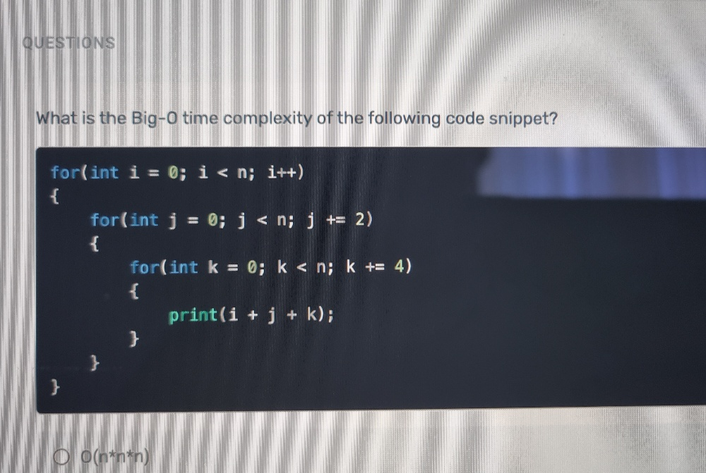
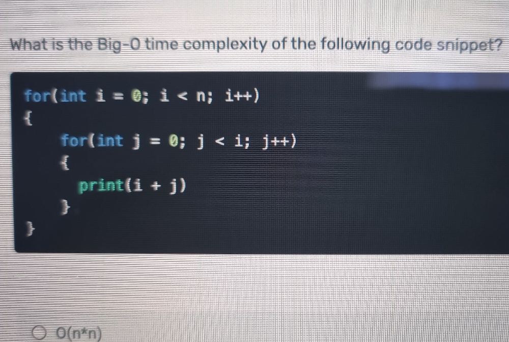
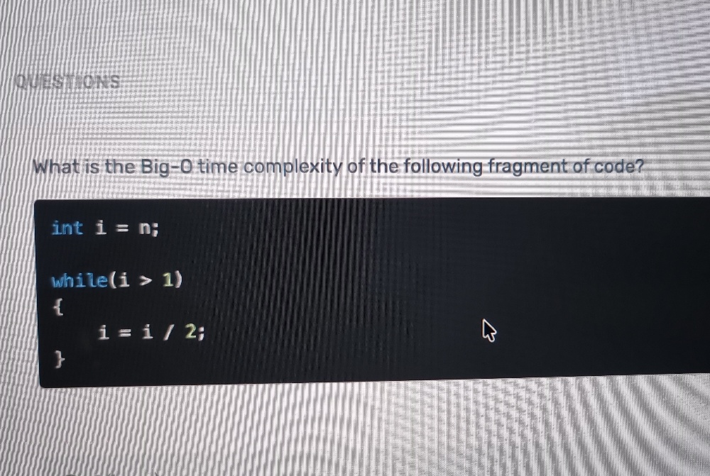
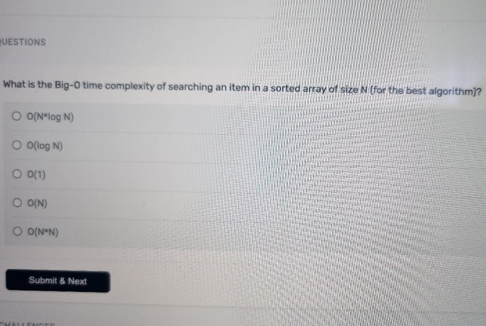

## Assessment Soruları

### Soru 1

Görseldeki kod parçasının Big-O zaman karmaşıklığı (time complexity) **$O(n^3)$** veya alt kısımda ucu gözüken şıktaki yazımıyla **$O(n*n*n)$**'dir.

İşte adım adım açıklaması:

1.  **Dıştaki döngü (`i`):** `i` değişkeni $0$'dan başlar ve her adımda $1$ artarak $n$'e kadar gider. Bu döngü **$n$** kez çalışır.
2.  **Ortadaki döngü (`j`):** `j` değişkeni $0$'dan başlar ve her adımda $2$ artarak $n$'e kadar gider ($0, 2, 4, 6...$). Bu döngü **$n/2$** kez çalışır.
3.  **İçteki döngü (`k`):** `k` değişkeni $0$'dan başlar ve her adımda $4$ artarak $n$'e kadar gider ($0, 4, 8, 12...$). Bu döngü **$n/4$** kez çalışır.

Bu döngüler iç içe olduğu için karmaşıklıkları birbirleriyle çarpılır:
$$n \cdot \frac{n}{2} \cdot \frac{n}{4} = \frac{n^3}{8}$$

Big-O notasyonunda sabit katsayılar (buradaki $1/8$ gibi) performansı asimptotik olarak etkilemediği için göz ardı edilir. Bu nedenle sonuç **$O(n^3)$** olur.

### Soru 2

Görseldeki kod parçasının Big-O zaman karmaşıklığı **$O(n^2)$** veya görselin alt kısmında görünen şıktaki yazımıyla **$O(n*n)$**'dir.

İşte adım adım açıklaması:

1. **Dıştaki döngü (`i`):** `i` değişkeni $0$'dan başlayıp $n$'e kadar gider. Bu döngü kendi başına $n$ kez tetiklenir.
2. **İçteki döngü (`j`):** Bu döngünün çalışma sayısı sabit değildir; dıştaki `i` değişkeninin o anki değerine bağlıdır. `j` değişkeni $0$'dan başlayıp `i`'ye kadar gider.

Toplam işlem sayısını bulmak için `i`'nin aldığı her değere karşılık iç döngünün kaç kere çalıştığına bakalım:
* `i = 0` olduğunda iç döngü **$0$** kez çalışır.
* `i = 1` olduğunda iç döngü **$1$** kez çalışır (`j = 0`).
* `i = 2` olduğunda iç döngü **$2$** kez çalışır (`j = 0, 1`).
* ...
* `i = n - 1` olduğunda iç döngü **$n - 1$** kez çalışır.

İçerideki `print(i + j)` işleminin toplam çalışma sayısı, bu adımların toplamına eşittir. Bu da ilk $n-1$ sayının toplamı formülüyle hesaplanır:

$$0 + 1 + 2 + \dots + (n-1) = \frac{(n-1) \cdot n}{2} = \frac{n^2 - n}{2}$$

Big-O notasyonunda, veri boyutu sonsuza giderken asıl etkiyi yaratan en yüksek dereceli terim dikkate alınır. Düşük dereceli terimler ($-n/2$) ve katsayılar ($1/2$) göz ardı edilir. 

Bu sebeple $\frac{n^2 - n}{2}$ ifadesinin asimptotik karmaşıklığı **$O(n^2)$** olur.

### Soru 3

Görseldeki kod parçasının Big-O zaman karmaşıklığı **$O(\log n)$**'dir.

İşte adım adım açıklaması:

1. **Başlangıç:** Döngü `i = n` değeri ile başlar.
2. **Azalma Miktarı:** Her adımda `i`'nin değeri yarıya iner (`i = i / 2`).
3. **Bitiş Koşulu:** Döngü, `i` değeri $1$'e (veya daha küçüğüne) düşene kadar devam eder.

Bu bölme işleminin kaç kere tekrar edeceğini (diyelim ki $k$ adım) bulmak için şu mantığı kurabiliriz:
* **1. adım:** $n / 2^1$
* **2. adım:** $n / 2^2$ ($n/4$)
* **3. adım:** $n / 2^3$ ($n/8$)
* ...
* **$k$. adım:** $n / 2^k$

Döngünün sonlanması için $k$. adımdaki değerin $1$'e eşit olması gerekir:
$$\frac{n}{2^k} = 1$$
$$n = 2^k$$

Döngünün kaç adım çalıştığını ($k$) bulmak için her iki tarafın logaritmasını almamız gerekir:
$$k = \log_2(n)$$

Bölme veya çarpma yoluyla veri setinin her adımda belirli bir oranda (örneğin ikiye, üçe vb.) küçüldüğü ya da büyüdüğü algoritmalar **logaritmik zaman karmaşıklığına** sahiptir. Big-O notasyonunda logaritma tabanı asimptotik büyüme oranını etkileyen sabit bir çarpan olduğu için genellikle yazılmaz ve sonuç **$O(\log n)$** olarak ifade edilir.

### Soru 4

Görseldeki sorunun cevabı **$O(\log N)$**'dir.

İşte açıklaması:

Soru, **sıralı (sorted)** bir dizide eleman aramak için kullanılabilecek *en iyi* algoritmanın zaman karmaşıklığını soruyor.

Sıralı bir dizide arama yapmak için en verimli yöntem **Binary Search (İkili Arama)** algoritmasıdır. Algoritmanın çalışma mantığı şu şekildedir:

1. Aranan değeri, dizinin tam ortasındaki elemanla karşılaştırır.
2. Eğer aranan değer ortadaki elemandan küçükse, dizinin sağ yarısını tamamen eler ve aramaya sol yarıda devam eder.
3. Eğer büyükse, sol yarıyı eler ve aramaya sağ yarıda devam eder.
4. Bu işlem, aranan değer bulunana veya arama alanı tükenene kadar her adımda veri setini yarıya bölerek devam eder.

Bir önceki sorudaki `i = i / 2` döngüsünde olduğu gibi, veri setinin her adımda yarıya inmesi logaritmik bir azalma yaratır. Bu nedenle Binary Search algoritmasının zaman karmaşıklığı **$O(\log N)$** olur.

Neden **$O(1)$** değil! 
Cevabın **$O(1)$** olmamasının temel sebebi, **"indeks ile erişim" (access)** ve **"değer arama" (search)** arasındaki farktır. Ayrıca Big-O notasyonunun değerlendirme mantığıyla ilgilidir.

İşte detayları:

**1. Erişim (Access) ve Arama (Search) Farkı**
* **Erişim $O(1)$'dir:** Bir dizide sırasını (indeksini) bildiğiniz bir elemanı getirmek $O(1)$ karmaşıklığındadır. Örneğin, `dizi[5]` dediğinizde bilgisayar bellekte nereye gideceğini direkt hesaplar ve veri boyutu ne olursa olsun o elemanı tek adımda bulur.
* **Arama (Search):** Arama işleminde ise "42 sayısı bu dizinin neresinde?" diye sorarız. Yeri baştan bilinmediği için elemanları belirli bir mantığa göre kontrol etmek zorundayız. C#'taki standart diziler (`int[]`) veya `List<T>` gibi bellek üzerinde ardışık tutulan veri yapılarında, değerin yerini tahmin eden sihirli bir formül yoktur.

**2. Big-O En Kötü Durumu (Worst-Case) Temel Alır**
"Ya aradığım sayı dizinin tam ortasındaysa ve İkili Arama (Binary Search) ile veriyi böldüğüm ilk adımda bulursam? Bu $O(1)$ olmaz mı?" diye düşünebilirsiniz. 

Evet, o spesifik senaryo algoritmanın *en iyi durumudur (best-case)*. Ancak Big-O notasyonu algoritmaları analiz ederken genellikle **en kötü durumu (worst-case)** veya veri boyutu sonsuza giderken sistemin nasıl davranacağını (asimptotik sınır) ifade etmek için kullanılır. Aranan eleman dizide yoksa veya en uç noktadaysa, $N$ elemanlı bir dizide bölme işlemi maksimum $\log_2(N)$ kez yapılmak zorundadır. Bu yüzden genel karmaşıklık **$O(\log N)$** olarak kabul edilir.

**Peki Arama İşlemi Ne Zaman $O(1)$ Olur?**
Eğer arama işleminin veritabanı büyüklüğünden bağımsız olarak ortalamada **$O(1)$** sürede gerçekleşmesini istiyorsak, standart bir dizi yerine **Hash Table (Karma Tablosu)** tabanlı bir veri yapısı kurgulamamız gerekir. 

Örneğin, kodlamada sıkça kullandığımız `Dictionary<TKey, TValue>` yapısı tam olarak bu işi yapar. Aradığınız bir *Key* (Anahtar) değeri Hash fonksiyonuna sokulur ve bu fonksiyon size verinin bellekteki kesin indeksini geri döner. Böylece elemanları tek tek veya bölerek aramak zorunda kalmadan ortalamada tek bir hesaplamayla yani $O(1)$ sürede hedefe ulaşırsınız.

Özetle; sıralı bir dizide (Array) indeksini bilmediğimiz bir değeri aramanın en verimli matematiksel ve fiziksel sınırı veriyi sürekli ikiye bölmektir, bu da logaritmik bir maliyet yaratır.

### Soru 5: Coding Challenge

You are tasked with implementing a payment processing function for an application. Streamers have payment requests and our company has balances on certain currencies. We will pay streamers from our balances on currencies according to their requested amount. The function should handle fund allocation in our company's balance and make payments to streamers.

Function takes in the existing balance and payment requests to be processed as the input. It should deduct each payment request from the existing balance when there are enough funds. Then, return the remaining balance and paid payment requests as output. Here are the details:

**Input Format:** The function takes a single parameter, which is a string containing two sections separated by an '&' character:
* The first section lists available funds in the company's balance in the format `currency:amount|currency:amount|...`
* The second section lists payment requests in the format `streamer_id:currency:requested_amount|streamer_id:currency:requested_amount|...`
* All `amount` and `requested_amount` are guaranteed to be integers.
* Note that any of the first and second sections can be empty.
* You can assume input is always in the correct format.

**Output Format:** Return a string formatted as follows:
* Output should be in the same notation as input: balance and payment parts with the same concatenation character "&". Even if no payment or balance is listed, "&" concatenation character should always be stated.
* The balance part should be ordered by currency name alphabetically and the resulting balance should be stated according to the notation (`currency1:remaining_amount|currency2:remaining_amount&...`). Even if no balance is left after payments, each currency should be listed with zero balance in the balance part *if that currency was given in the input and supported*.
* Paid payment requests should be grouped together with their currency in the same order they're listed in the balance part of the output and ordered inside that group by the fee dropped amount ascending. *Only* the paid payment requests should be listed in the output.

**Requirements:**
* *Only* TRY, EUR, and USD should be supported. Skip funds and payments with unsupported currencies, and do not show unsupported currency balance and unsupported currency payment on the output.
* Each currency has a processing fee (1 for TRY and 2 for other supported currencies) applied to the `requested_amount`.
* The processing fee should be deducted from the `requested_amount` *before* making a payment (resulting in the `actual_amount`).
* `requested_amount` should be higher than the processing fee to pay the payment request. (i.e `actual_amount` should be positive)
* The `actual_amount` should be deducted from the company's balance.
* Ensure payments are processed in ascending order of `actual_amount` for each currency.
* Each successful payment under each currency should be sorted by `actual_amount` in ascending order.
* A streamer can have multiple payment requests both in the same currency or different currencies, payments should not be merged in any way and must appear separately in the output.
* Your program should be able to easily adapt to a new currency, if we plan to support new currency in the future.
* Clean coding and solving in acceptable time complexity will be evaluated as well.

**Examples**

**Example 1:**
* **Input:** `"TRY:5000|EUR:300|AZN:150&streamer1:USD:150|streamer2:EUR:100|streamer3:USD:200|streamer4:TRY:1400|streamer4:TRY:110|streamer6:AZN:10|streamer7:RUB:20|streamer16:TRY:8"`
* **Output:** `"EUR:202|TRY:3485&streamer2:EUR:98|streamer16:TRY:7|streamer4:TRY:109|streamer4:TRY:1399"`

**Example 2:**
* **Input:** `"USD:276|EUR:300|TRY:1100&streamer7:USD:120|streamer2:EUR:112|streamer55:USD:200|streamer4:TRY:1000|streamer5:TRY:375"`
* **Output:** `"EUR:190|TRY:726|USD:158&streamer2:EUR:110|streamer5:TRY:374|streamer7:USD:118"`

[**Coding Challenge Solution**](Scorp.CoddingChallenge/Program.cs)